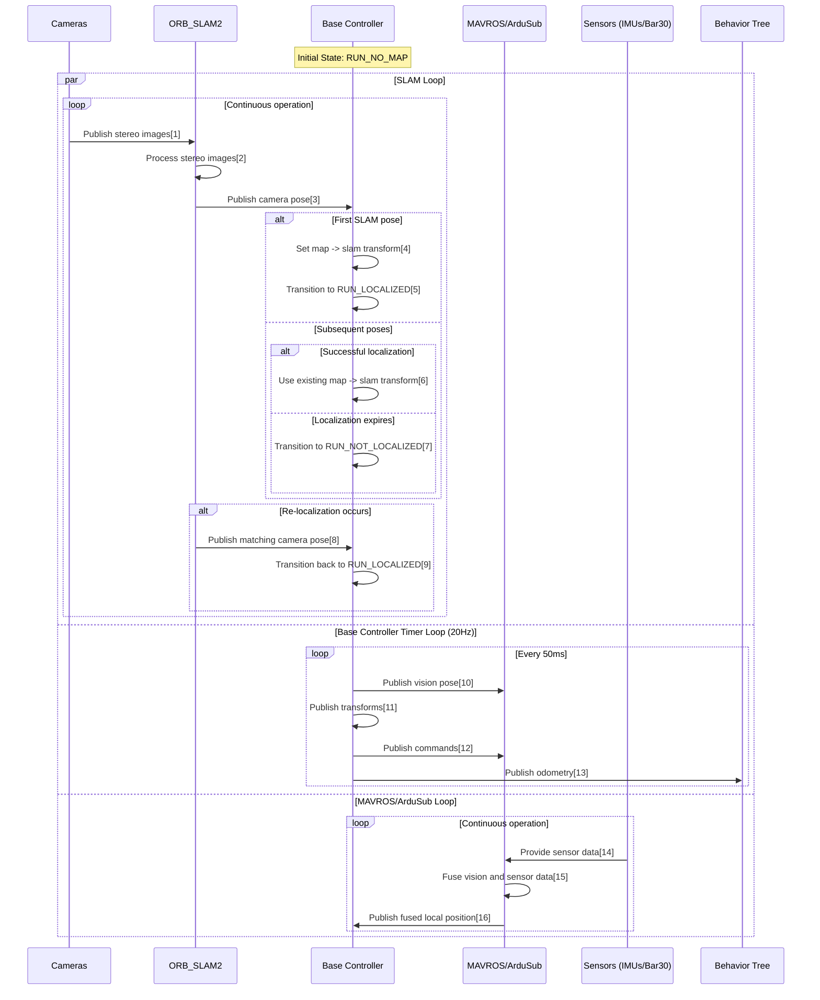

# Orca4 Design

## Sensors

* BlueRobotics [Bar30 depth sensor](https://bluerobotics.com/store/sensors-sonars-cameras/sensors/bar30-sensor-r1/)
* 2 IMUs on the [Pixhawk](https://ardupilot.org/copter/docs/common-pixhawk-overview.html)
* A down-facing stereo camera

## Diagram

1. [Cameras: Publish stereo images](https://github.com/WHOIGit/orca4/blob/main/orca_bringup/launch/sim_launch.py#L165)
2. [ORB_SLAM2: Process stereo images, detect ORB features](https://github.com/WHOIGit/orca4/blob/main/orca_bringup/launch/bringup.py#L190)
3. [ORB_SLAM2: Publish camera pose on /orb_slam2_stereo_node/pose](https://github.com/WHOIGit/orca4/blob/main/orca_base/src/base_controller.cpp#L293)
4. [Base Controller: Set tf_map_slam_ for first SLAM pose](https://github.com/WHOIGit/orca4/blob/main/orca_base/src/base_controller.cpp#L304)
5. [Base Controller: Transition to RUN_LOCALIZED](https://github.com/WHOIGit/orca4/blob/main/orca_base/src/base_controller.cpp#L312)
6. Base Controller: Use existing tf_map_slam_ for subsequent poses
7. [Base Controller: Transition to RUN_NOT_LOCALIZED if last SLAM expires](https://github.com/WHOIGit/orca4/blob/main/orca_base/src/base_controller.cpp#L263)
8. [ORB_SLAM2: Publish matching camera pose](https://github.com/WHOIGit/orca4/blob/main/orca_base/src/base_controller.cpp#L293)
9. [Base Controller: Transition back to RUN_LOCALIZED](https://github.com/WHOIGit/orca4/blob/main/orca_base/src/base_controller.cpp#L312)
10. [Base Controller: Publish vision pose on /mavros/vision_pose/pose](https://github.com/WHOIGit/orca4/blob/main/orca_base/src/base_controller.cpp#L170)
11. [Base Controller: Publish transforms](https://github.com/WHOIGit/orca4/blob/main/orca_base/src/base_controller.cpp#L248)
12. [Base Controller: Publish commands](https://github.com/WHOIGit/orca4/blob/main/orca_base/src/base_controller.cpp#L191)
13. [Base Controller: Publish odometry](https://github.com/WHOIGit/orca4/blob/main/orca_base/src/base_controller.cpp#L254)
14. Sensors: Provide IMU and barometer data to MAVROS/ArduSub
15. MAVROS/ArduSub: Fuse vision pose with sensor data
16. [MAVROS/ArduSub: Publish fused local position on /mavros/local_position/pose](https://github.com/WHOIGit/orca4/blob/main/orca_base/src/base_controller.cpp#L270)

## Current Use Cases

ORB_SLAM2 detects and manages a single continuous map of ORB features.

Case 1: The sub starts at the surface with good visibility of the seafloor and maintains visibility
during the mission.

Case 2: The sub starts at the surface, but the seafloor is not visible. The sub dives to
obtain good visibility of the seafloor. Once the seafloor is discovered the mapping begins.

## Future Use Cases

Case 3: After mapping starts the sub loses visibility of the seafloor and enters into recovery
actions to rediscover a previously mapped portion of the seafloor. No mapping occurs during
recovery.

Case 4: Visibility is lost and the sub discovers an unmapped patch of seafloor and starts building
a separate map. This may repeat. The origins of the subsequent maps are set by dead reckoning.
The map origins may be adjusted over time as exploration continues. Maps may be merged if they
are found to overlap.

Case 5: A GPS sensor is available to provide good poses at the surface. These poses can be used to
improve the origin poses of the map(s). The sub may ascend and descend while mapping regions.

## Coordinate Frames

Orca4 uses the 3 coordinate frames described in [ROS REP 105](https://www.ros.org/reps/rep-0105.html):
**base_link**, **odom** and **map**. A fourth **slam** frame is used to handle the case when mapping
starts late.

### base_link

The base_link frame is a body frame, centered on the sub itself.

The ROS body frame convention is FLU: x-forward, y-left, z-up.

The ArduSub body frame convention is FRD: x-forward, y-right, z-down.

### odom

The odom frame is a world frame used to describe the sub's pose in the local environment.

The ROS world frame convention is ENU: x-east, y-north, z-up.

The ArduSub world frame convention is NED: x-north, y-east, z-down.

The initial pose is {0, 0, 0} facing east, where the z origin is the surface of the water.

The pose is predicted from the Nav2-generated desired velocity and a simple motion model.

ArduSub does not know about the odom frame.

In the simulation you can see the error between the simple Orca4 motion model and the more accurate
Gazebo motion model by observing the TF chain map -> odom -> base_link.

### map

The map frame is a world frame used to describe the sub's pose in the global environment.

The initial pose is {0, 0, 0} facing east, where the z origin is the surface of the water.

The map frame is the same as a MAVLink LOCAL frame such as MAV_FRAME_LOCAL_ENU.
The ArduSub EKF is running in the map frame.

ArduSub also keeps a MAVLink GLOBAL frame that is expressed in altitude, latitude and longitude.
Orca4 does not use this GLOBAL frame.

### slam

The slam frame records the global position of the sub when the ORB_SLAM2 first generates a map.

In future use cases there will be multiple slam frames, one for each SLAM-generated map.

### Helper frames

By default ORB_SLAM2 assumes that the stereo camera is facing forward. The **down** frame is rotated
to point the camera down towards the seafloor.

MAVROS handles NED/ENU and FLU/FRD translations, and publishes transforms for helper frames
**map_ned**, **odom_ned** and **base_link_frd**.

## Control Summary

The [Manager](src/manager.cpp) node manages the state of ArduSub, MAVROS and Orca4. 

The [BaseController](src/base_controller.cpp) node sends `VISION_POSITION_ESTIMATE` messages to ArduSub at 5Hz.
The ArduSub EKF fuses these poses with the barometer and IMU readings.
* When the system boots the default pose {0, 0, 0} is sent to warm the ArduSub EKF
* If the sub moves before mapping starts (dead reckoning), the pose generated by the BaseController motion model is sent
* Once mapping starts the pose from ORB_SLAM2 is sent

Nav2 uses the latest map pose to plan a route at 1Hz.
Nav2 publishes a desired velocity vector on `/cmd_vel` at 20Hz.

BaseController turns the desired velocity vector into `SET_POSITION_TARGET_GLOBAL_INT` messages to
set the desired depth, and into `OVERRIDE_RC` messages to control the x and yaw RC inputs.
Both messages are sent at 20Hz.

ArduSub is in ALT_HOLD mode. ArduSub uses a PID controller to hold the target depth.
ArduSub blends the PID outputs with the RC overrides to drive the thrusters.

## Life of a Pose

_This narrative follows the life of a single map -> base_link pose, showing how it moves from
system to system. Mapping has started. Helper transforms are ignored._

Gazebo calculates the actual (ground truth) pose of the sub using the Thruster, Buoyancy
and Hydrodynamics plugins. (This is published on `/model/orca/odometry` by ros_ign and is visible
in Rviz2.)

ArduPilotPlugin sends the pose to ArduSub, along with gyro and accel data from a simulated IMU.

ArduSub generates noisy measurements for 2 fake IMUs and a fake barometer.
(I'm not entirely sure who generates the IMU noise -- Gazebo or ArduSub or both?)

Gazebo also generates simulated camera images and ros_ign publishes them on `/stereo_left` and
`/stereo_right`.

ORB_SLAM2 processes the camera images, detects ORB features, computes a camera pose, and 
publishes it on `/orb_slam2_stereo_node/pose`.

BaseController subscribes to `/orb_slam2_stereo_node/pose`, computes the pose of the sub (vs
the camera), and publishes it on `/mavros/vision_pose/pose`.
BaseController also publishes the map -> odom transform.

MAVROS subscribes to `/mavros/vision_pose/pose` and sends a `VISION_POSITION_ESTIMATE`
message to ArduSub.

ArduSub fuses the vision, barometer and IMU measurements into an estimated pose.
ArduSub splits this pose into 2 messages: LOCAL_POSITION (x, y, z) message and ATTITUDE (roll, pitch, yaw).

MAVROS recombines the LOCAL_POSITION and ATTITUDE information into a pose and publishes it on
`/mavros/local_position/pose`.

Nav2 subscribe to all transforms, plans a route at 1Hz, and publishes the desired x, z and yaw
velocities on `/cmd_vel` at 20Hz.

BaseController subscribes to `/mavros/local_position/pose` and `/cmd_vel`, computes the desired z
position, and publishes it on `/mavros/setpoint_position/global`.

MAVROS subscribes to `/mavros/setpoint_position/global` and sends a SET_POSITION_TARGET_GLOBAL_INT
message to ArduSub.

ArduSub calculates servo commands to achieve and hold the desired z position.

BaseController also computes the desired x and yaw values, computes the thrust required, and
publishes an RC override message on `/mavros/rc/override`.

MAVROS subscribes to `/mavros/rc/override` and sends an OVERRIDE_RC message to ArduSub.

ArduSub applies the RC overrides to the RC outputs.

ArduPilotPlugin sends servo commands to the Thruster plugins.

The ThrusterPlugins apply thrust forces and spin the propellers in Gazebo.

## Manager Node

The Manager node listens on `/set_target_mode` and moves between the
[DISARMED, ROV, and AUV](../orca_msgs/action/TargetMode.action) modes by monitoring and controlling
other systems. Functions include:

* arming or disarming the thrusters by calling `/mavros/cmd/arming`
* setting the ArduSub mode by calling `/mavros/set_mode`
* requesting MAVLink messages by calling `/mavros/set_message_interval`
* activating the Nav2 system by calling `/lifecycle_manager_navigation/manage_nodes`
* taking or releasing control of the sub by calling `/conn`

| Parameter | Type         | Default  | Notes                                                                                       |
|-----------|--------------|----------|---------------------------------------------------------------------------------------------|
| msg_ids   | array of int | [31, 32] | Manager will ask ArduSub to send these MAVLink messages. This request is re-sent every 10s. |
| msg_rate  | int          | 20       | Desired message rate in Hz.                                                                 |

## BaseController Node

The BaseController node listens on `/conn` and drives the sub in AUV mode. Functions include:
* listen to `/cmd_vel` and estimate motion
* listen to `/mavros/local_position/pose` and `/orb_slam2_stereo_node/pose` and compute and broadcast all dynamic transforms
* manage localization states, e.g., RUN_NO_MAP, RUN_LOCALIZED, RUN_NOT_LOCALIZED
* if BaseController is driving, publish messages on `/mavros/setpoint_position/global` and `/mavros/rc/override`
* publish diagnostics on `/odom` and `/motion`

### Motion model parameters

There's a very simple motion model that considers buoyancy and drag.
It does not consider added mass.

| Parameter | Type | Default | Notes |
|---|---|---|---|
| mdl_mass | double | 9.75 | Mass, kg |
| mdl_volume | double | 0.01 | Displacement volume, m^3 |
| mdl_fluid_density | double | 997 | Fluid density, kg/m^3, typically 997 for freshwater, 1027 for seawater |
| mdl_thrust_scale | double | 0.7 | Global thrust scale, used to boost small thrust values typical for AUV operation |
| mdl_drag_coef_x | double | 0.8 | Drag coefficient for forward / back motion |
| mdl_drag_coef_y | double | 0.95 | Drag coefficient for strafing motion |
| mdl_drag_coef_z | double | 0.95 | Drag coefficient for vertical motion |
| mdl_drag_partial_const_yaw | double | 0.004 | Drag coefficient for yaw motion |
| mdl_thrust_dz_pwm | int16 | 35 | Thruster deadzone |

### Control parameters

| Parameter               | Type   | Default   | Notes                                      |
|-------------------------|--------|-----------|--------------------------------------------|
| ardu_frame_id           | string | map       | ArduSub EKF frame id                       |
| slam_frame_id           | string | slam      | ORB_SLAM2 frame id                         |
| down_frame_id           | string | down      | Rotated ORB_SLAM2 frame id                 |
| odom_frame_id           | string | odom      | Odom frame id                              |
| base_frame_id           | string | base_link | Base frame id                              |
| slam_timeout_ms         | int    | 1000      | SLAM timeout                               |
| transform_expiration_ms | int    | 0         | Transform expiration, 0 means don't expire |
| timer_rate              | int    | 20        | Main loop timer in Hz                      |
| x_vel                   | double | 0.4       | Max forward / back velocity, m/s           |
| y_vel                   | double | 0.4       | Max strafing velocity, m/s                 |
| z_vel                   | double | 0.2       | Max vertical velocity, m/s                 |
| yaw_vel                 | double | 0.4       | Max yaw velocity, r/s                      |
| x_accel                 | double | 0.4       | Max forward / back acceleration, m/s^2     |
| y_accel                 | double | 0.4       | Max strafing acceleration, m/s^2           |
| z_accel                 | double | 0.2       | Max vertical acceleration, m/s^2           |
| yaw_accel               | double | 0.4       | Max yaw acceleration, r/s^2                |
| coast                   | bool   | false     | Coast mode (TODO)                          |
