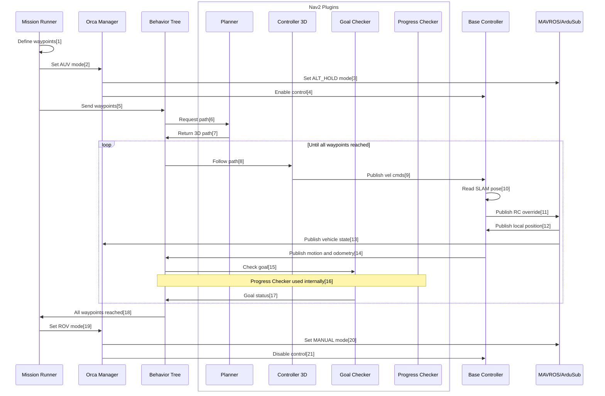

# Diagram

1. [Mission Runner: Define waypoints](https://github.com/WHOIGit/orca4/blob/main/orca_bringup/scripts/mission_runner.py#L73)
2. [Mission Runner: Set AUV mode](https://github.com/WHOIGit/orca4/blob/main/orca_bringup/scripts/mission_runner.py#L153)
3. [Orca Manager: Set ALT_HOLD mode](https://github.com/WHOIGit/orca4/blob/main/orca_base/src/manager.cpp#L186)
4. [Orca Manager: Enable control](https://github.com/WHOIGit/orca4/blob/main/orca_base/src/manager.cpp#L190)
5. [Mission Runner: Send nav goal](https://github.com/WHOIGit/orca4/blob/main/orca_bringup/scripts/mission_runner.py#L155)
6. [Behavior Tree: Request path](https://github.com/WHOIGit/orca4/blob/main/orca_bringup/behavior_trees/orca4_bt.xml#L12)
7. [Planner: Return 3D path](https://github.com/WHOIGit/orca4/blob/main/orca_nav2/src/straight_line_planner_3d.cpp#L164)
8. [Behavior Tree: Follow path](https://github.com/WHOIGit/orca4/blob/main/orca_bringup/behavior_trees/orca4_bt.xml#L14)
9. [Controller: Publish vel cmds](https://github.com/WHOIGit/orca4/blob/main/orca_nav2/src/pure_pursuit_controller_3d.cpp#L165)
10. [Base Controller: Read SLAM pose](https://github.com/WHOIGit/orca4/blob/main/orca_base/src/base_controller.cpp#L293)
11. [Base Controller: Publish RC override](https://github.com/WHOIGit/orca4/blob/main/orca_base/src/base_controller.cpp#L191)
12. [MAVROS/ArduSub: Publish local position](https://github.com/WHOIGit/orca4/blob/main/orca_base/src/base_controller.cpp#L270)
13. [MAVROS/ArduSub: Publish vehicle state](https://github.com/WHOIGit/orca4/blob/main/orca_base/src/manager.cpp#L444)
14. [Base Controller: Publish motion and odometry](https://github.com/WHOIGit/orca4/blob/main/orca_base/src/base_controller.cpp#L238)
15. [Behavior Tree: Check goal](https://github.com/WHOIGit/orca4/blob/main/orca_bringup/behavior_trees/orca4_bt.xml#L17)
16. [Progress Checker: Check progress (internal to Nav2)](https://github.com/WHOIGit/orca4/blob/main/orca_nav2/src/progress_checker_3d.cpp#L69)
17. [Goal Checker: Goal status](https://github.com/WHOIGit/orca4/blob/main/orca_nav2/src/goal_checker_3d.cpp#L76)
18. [Mission Runner: Goal reached](https://github.com/WHOIGit/orca4/blob/main/orca_bringup/scripts/mission_runner.py#L112)
19. [Mission Runner: Set ROV mode](https://github.com/WHOIGit/orca4/blob/main/orca_bringup/scripts/mission_runner.py#L158)
20. [Orca Manager: Set MANUAL mode](https://github.com/WHOIGit/orca4/blob/main/orca_base/src/manager.cpp#L258)
21. [Orca Manager: Disable control](https://github.com/WHOIGit/orca4/blob/main/orca_base/src/manager.cpp#L226)

# Orca4 Nav2 Plugins

The following Nav2 plugins provide basic 3D planning and control suitable for open water. They all
ignore the global and local costmaps. They all largely ignore yaw, though the
`PurePursuitController3D` will generate a value for yaw (`angular.z`) in `cmd_vel`.

> Note for Humble: Nav2 now includes a [velocity smoother](https://navigation.ros.org/configuration/packages/configuring-velocity-smoother.html)
node which takes cmd_vel output from the Nav2 controller(s) and does velocity, acceleration, and deadband smoothing.
This node isn't 3D-aware, so it isn't used in Orca4.

## StraightLinePlanner3D

The `StraightLinePlanner3D` plugin is similar to the 
[`StraightLinePlanner`](https://github.com/ros-planning/navigation2_tutorials/tree/master/nav2_straightline_planner) plugin.
The planner can plan in two segments (vertical motion first, then horizontal) or one segment
(vertical and horizontal motion combined).

Parameters:

| Parameter     | Type   | Default | Notes                                 |
|---------------|--------|---------|---------------------------------------|
| planning_dist | double | 0.1     | How far apart the plan poses are, m   |
| z_before_xy   | bool   | false   | If true plan in 2 segments: z then xy |

## PurePursuitController3D

The `PurePursuitController3D` plugin is similar to the
[`PurePursuitController`](https://github.com/ros-planning/navigation2_tutorials/tree/master/nav2_pure_pursuit_controller) plugin.
It limits horizontal, vertical and yaw acceleration to reduce pitching and drift.
The BlueROV2 frame is holonomic, but forward/backward drag is lower than the left/right drag, so the
controller generates diff-drive motion (`linear.x`, `linear.z` and `angular.z`).

Parameters:

| Parameter | Type | Default | Notes |
|---|---|---|---|
| xy_vel | double | 0.4 | Desired horizontal velocity, m/s |
| xy_accel | double | 0.4 | Max horizontal acceleration, m/s^2 |
| z_vel | double | 0.2 | Desired vertical velocity, m/s |
| z_accel | double | 0.2 | Max vertical acceleration, m/s^2 |
| yaw_vel | double | 0.4 | Desired yaw velocity, r/s |
| yaw_accel | double | 0.4 | Max yaw acceleration, r/s^2 |
| lookahead_dist | double | 1.0 | Lookahead distance for pure pursuit algorithm, m |
| transform_tolerance | double | 1.0 | How stale a transform can be and still be used, s |
| goal_tolerance | double | 0.1 | Stop moving when goal is closer than goal_tolerance. Should be less than the values in GoalChecker3D |
| tick_rate | double | 20 | The BT tick rate, used to calculate dt |

## ProgressChecker3D

The `ProgressChecker3D` plugin is similar to the
[`SimpleProgressChecker`](https://github.com/ros-planning/navigation2/tree/main/nav2_controller/plugins) plugin.

Parameters:

| Parameter | Type | Default | Notes |
|---|---|---|---|
| radius | double | 0.5 | Minimum distance to move, m |
| time_allowance | double | 10.0 | Time allowed to move the minimum distance, s |

## GoalChecker3D

The `GoalChecker3D` plugin is similar to the
[`SimpleGoalChecker`](https://github.com/ros-planning/navigation2/tree/main/nav2_controller/plugins) plugin.

Parameters:

| Parameter | Type | Default | Notes |
|---|---|---|---|
| xy_goal_tolerance | double | 0.25 | Horizontal goal tolerance |
| z_goal_tolerance | double | 0.25 | Vertical goal tolerance |
